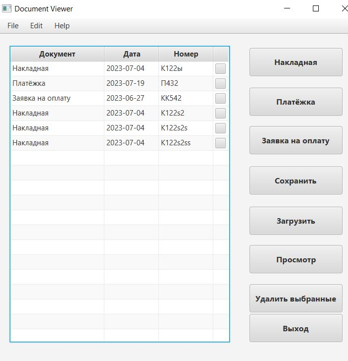
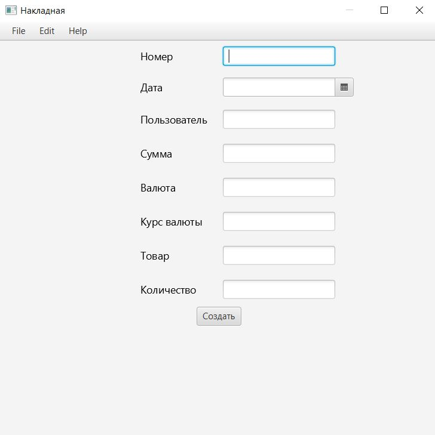
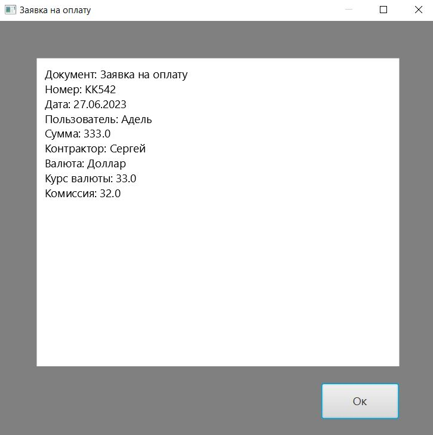

# Document Viewer
Десктопное приложение для управления документами со следующими функциями:
- Создание документов 3-х типов
- Хранение документов в локальной базе данных на диске (H2 database)
- Просмотр документов
- Удаление выбранных документов
- Сохранение документов в виде текстового файла
- Загрузка документов с текстового файла
# Технологии
- JavaFx
- Spring Boot
- Spring Data Jpa
- Jackson
- H2 database
- Lombok
- JavaFx Weaver
# Пример работы

